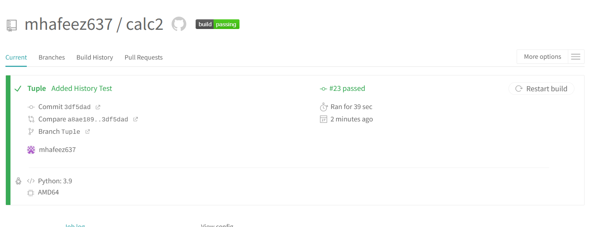
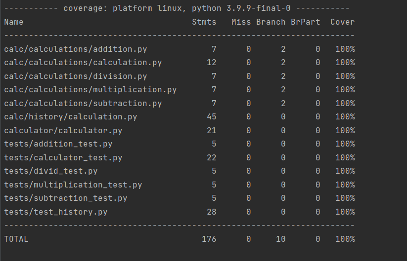
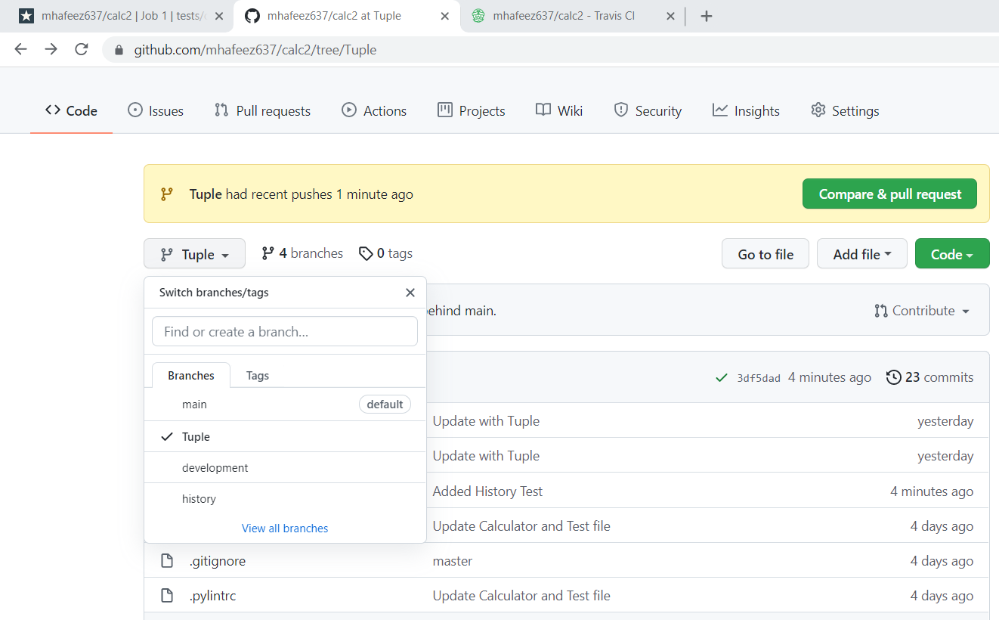

# My Calculator Program

Run Pip Install pip install -r requirements.txt

To run tests, Lint, and Coverage report use this command:

pytest --pylint --cov

.pylintrc is the config for pylint .coveragerc is the config for coverage setup.py is a config file for pytest

